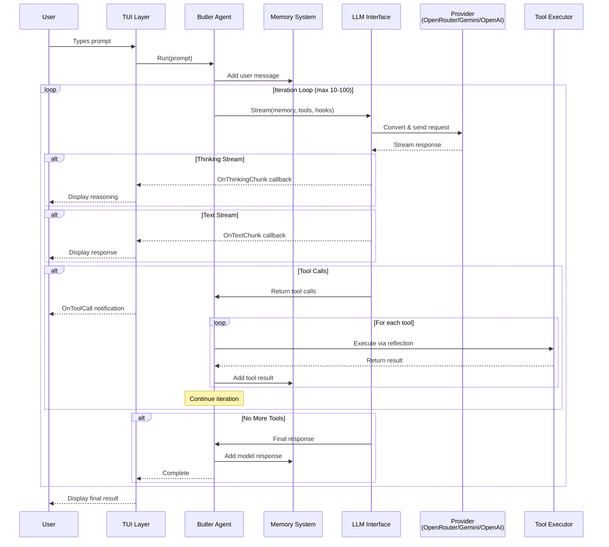
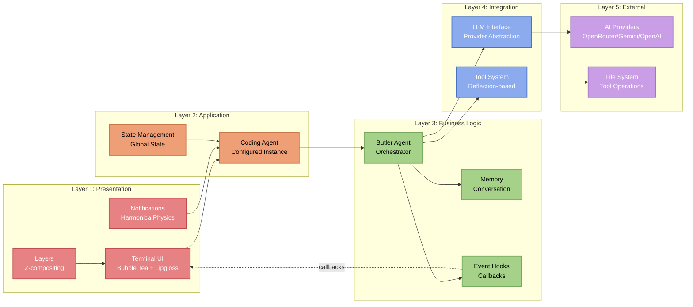
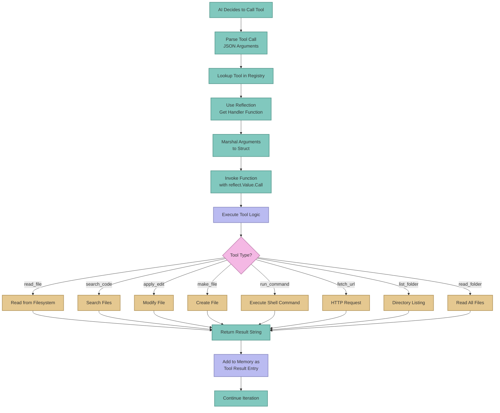
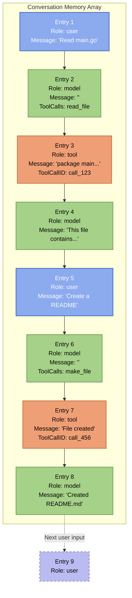

# ArloCode Architecture Diagram

## System Overview

```mermaid
graph TB
    subgraph "Entry Point"
        Main[main.go]
        CMD[cmd/root.go]
    end

    subgraph "Terminal UI Layer"
        TUI[internal/tui/app]
        Layers[internal/tui/layers<br/>Z-axis Compositing]
        Notifs[internal/tui/notifications<br/>Animated Toasts]
        Conv[internal/tui/app/conversation<br/>Chat Manager]
        State[internal/tui/state<br/>Global State]
        Themes[internal/tui/themes]
    end

    subgraph "Agent Layer"
        CodingAgent[internal/coding_agent<br/>Pre-configured Agent]
    end

    subgraph "Butler Framework - Core"
        Agent[internal/butler/agent<br/>Orchestrator]
        Memory[internal/butler/memory<br/>Conversation History]
        Tools[internal/butler/tools<br/>Reflection-based Functions]
        EventHooks[internal/butler/types<br/>Event Hooks]
    end

    subgraph "Butler Framework - LLM Interface"
        LLMInterface[internal/butler/llm<br/>Provider Interface]
        OpenRouterLLM[internal/butler/llm/openrouter]
        GeminiLLM[internal/butler/llm/gemini]
        OpenAILLM[internal/butler/llm/openai]
    end

    subgraph "Provider Implementations"
        OpenRouterProvider[internal/butler/providers/openrouter]
        GeminiProvider[internal/butler/providers/gemini]
        OpenAIProvider[internal/butler/providers/openai]
        ProviderTypes[internal/butler/providers/providers.go<br/>ProviderResponse]
    end

    subgraph "External APIs"
        OpenRouterAPI[OpenRouter API<br/>Multiple Models]
        GeminiAPI[Google Gemini API]
        OpenAIAPI[OpenAI API]
    end

    subgraph "External Libraries"
        BubbleTea[Bubble Tea<br/>TUI Framework]
        Lipgloss[Lipgloss<br/>Styling]
        Harmonica[Harmonica<br/>Spring Physics]
        Cobra[Cobra<br/>CLI]
    end

    subgraph "Standard Toolset"
        ReadFile[read_file]
        ReadFolder[read_folder]
        ListContents[list_folder_contents]
        SearchCode[search_code]
        ApplyEdit[apply_edit]
        FetchURL[fetch_url_as_markdown]
        MakeFile[make_file]
        RunCommand[run_command]
    end

    %% Entry Flow
    Main --> CMD
    CMD --> TUI
    CMD --> CodingAgent
    CMD --> State

    %% TUI Internal
    TUI --> Layers
    TUI --> Notifs
    TUI --> Conv
    TUI --> Themes
    TUI --> State
    
    %% TUI to Agent
    TUI --> CodingAgent
    CodingAgent --> Agent

    %% Agent Core Relationships
    Agent --> Memory
    Agent --> Tools
    Agent --> LLMInterface
    Agent --> EventHooks
    EventHooks -.->|callbacks| TUI

    %% LLM Interface to Implementations
    LLMInterface --> OpenRouterLLM
    LLMInterface --> GeminiLLM
    LLMInterface --> OpenAILLM

    %% LLM to Providers
    OpenRouterLLM --> OpenRouterProvider
    GeminiLLM --> GeminiProvider
    OpenAILLM --> OpenAIProvider

    %% Providers to APIs
    OpenRouterProvider --> OpenRouterAPI
    GeminiProvider --> GeminiAPI
    OpenAIProvider --> OpenAIAPI

    %% Provider Response Flow
    OpenRouterProvider --> ProviderTypes
    GeminiProvider --> ProviderTypes
    OpenAIProvider --> ProviderTypes
    ProviderTypes --> LLMInterface

    %% Tools to Standard Toolset
    Tools --> ReadFile
    Tools --> ReadFolder
    Tools --> ListContents
    Tools --> SearchCode
    Tools --> ApplyEdit
    Tools --> FetchURL
    Tools --> MakeFile
    Tools --> RunCommand

    %% External Library Usage
    TUI --> BubbleTea
    TUI --> Lipgloss
    Notifs --> Harmonica
    CMD --> Cobra

    %% Styling
    classDef entry fill:#e78284,stroke:#c24a4f,stroke-width:3px,color:#fff
    classDef tui fill:#8caaee,stroke:#4673c4,stroke-width:2px,color:#fff
    classDef agent fill:#a6d189,stroke:#74a95d,stroke-width:2px,color:#000
    classDef butler fill:#ef9f76,stroke:#c97849,stroke-width:2px,color:#000
    classDef llm fill:#ca9ee6,stroke:#a275c4,stroke-width:2px,color:#fff
    classDef provider fill:#f4b8e4,stroke:#c488b4,stroke-width:2px,color:#000
    classDef external fill:#81c8be,stroke:#5b9c91,stroke-width:2px,color:#000
    classDef tools fill:#e5c890,stroke:#b59860,stroke-width:2px,color:#000
    classDef lib fill:#babbf1,stroke:#8a8bc1,stroke-width:2px,color:#000

    class Main,CMD entry
    class TUI,Layers,Notifs,Conv,State,Themes tui
    class CodingAgent agent
    class Agent,Memory,Tools,EventHooks butler
    class LLMInterface,OpenRouterLLM,GeminiLLM,OpenAILLM llm
    class OpenRouterProvider,GeminiProvider,OpenAIProvider,ProviderTypes provider
    class OpenRouterAPI,GeminiAPI,OpenAIAPI external
    class ReadFile,ReadFolder,ListContents,SearchCode,ApplyEdit,FetchURL,MakeFile,RunCommand tools
    class BubbleTea,Lipgloss,Harmonica,Cobra lib
```

## Data Flow Diagram

## Component Layer Architecture

## Tool Execution Flow

## Memory Structure

---

## Legend

- **Red/Pink**: Entry points and main execution
- **Blue**: UI/TUI components
- **Green**: Agent layer
- **Orange**: Butler core framework
- **Purple**: LLM abstraction layer
- **Light Purple**: Provider implementations
- **Teal**: External services/APIs
- **Yellow**: Tool implementations
- **Light Blue**: External libraries

---

## Key Relationships

1. **TUI ← EventHooks → Agent**: Real-time streaming via callbacks
2. **Agent → Memory**: Every interaction stored for context
3. **Agent → LLM Interface**: Provider-agnostic communication
4. **LLM Interface → Providers**: Specific implementation adapters
5. **Agent → Tools**: Reflection-based dynamic execution
6. **Tools → Filesystem/Shell**: Actual operations on user's system

